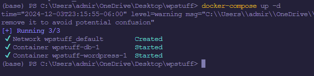
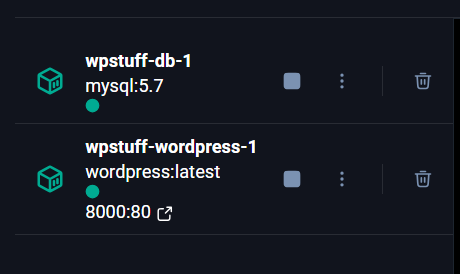
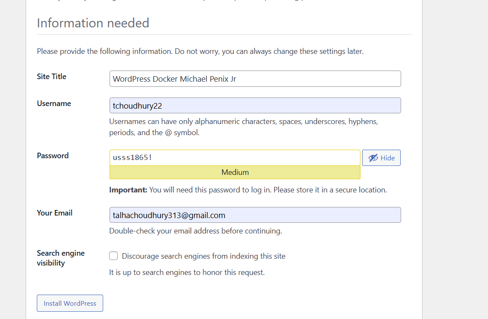
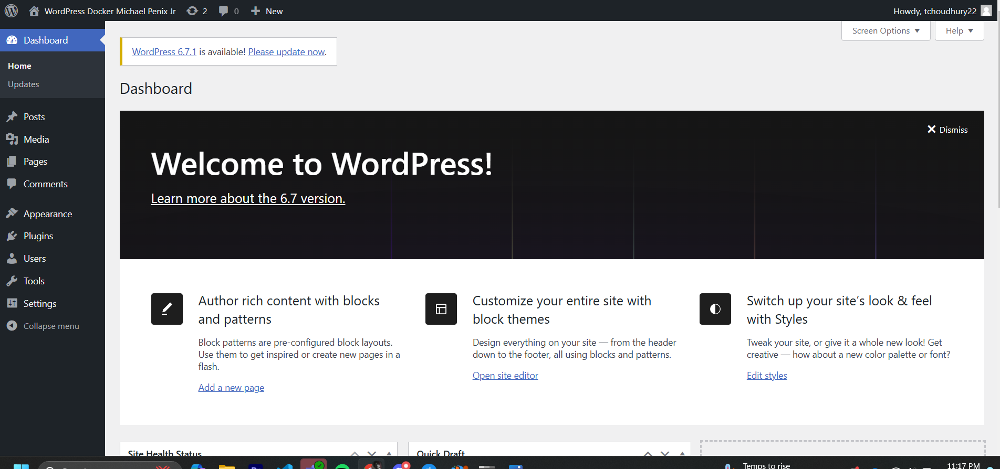

# Project 2: Docker Compose With Wordpress

## **System Administration**


### Talha Choudhury
-------


## Part 1: Getting Docker Engine For Windows

**The first part of the project will be to get the docker**

* Step 1: On browser look up Docker Desktop and Install. With the provided URL: 

* Step 2: On the file system, make a directory and keep it empty. This is where the config file will go.

* Step 3: Open some kind of text editor (I went Visual Studio Code). And we want to use this to make a configuration file. For the sake of simplicity and probably functionality name it ``docker-compose.yml`
**Inside of this the yml file for the wordpress image will go**

* Step 4: Paste the following configurations: This is a good starter

```
version: '3.3'

services:
   db:
     image: mysql:5.7
     volumes:
       - db_data:/var/lib/mysql
     restart: always
     environment:
       MYSQL_ROOT_PASSWORD: tc22!
       MYSQL_DATABASE: wordpress
       MYSQL_USER: tchoudhury22
       MYSQL_PASSWORD: usss1865!
   wordpress:
     depends_on:
       - db
     image: wordpress:latest
     ports:
       - "8000:80"
     restart: always
     environment:
       WORDPRESS_DB_HOST: db:3306
       WORDPRESS_DB_USER: DESIRED_USERNAME
       WORDPRESS_DB_PASSWORD: DESIRED_PASSWORD
       WORDPRESS_DB_NAME: wordpress
volumes:
    db_data: {}

```

* Step 5: Initialize the site by running the command `docker-compose up -d` - This will initialize the container, and let you access it via the localhost browser on your local machine.




 - In the Docker Desktop Application you will notice a container with your directory name become active.
 

 * Click on this and you'll see the other menus.
 
 This has a direct link to the localhost where you will be prompted with the installation process for the Wordpress. 


 * Step 6: Wordpress setup
- Select the region
- Make a site name
- Make a username and password
- Then click install


* Step 7: Login with the credentials you created.

* Step 8: Profit 🤑
